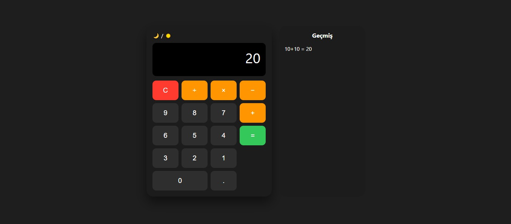
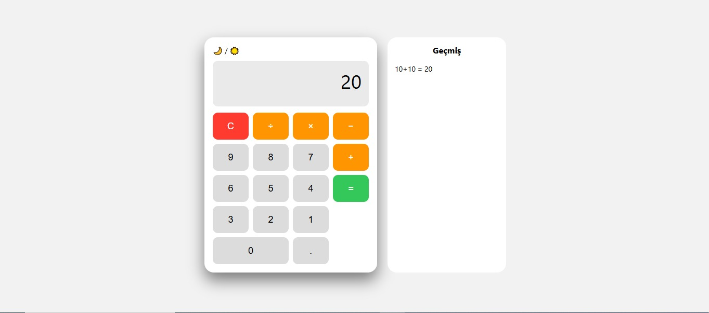

## Preview

# Beginner-Friendly Calculator

A clean and interactive calculator application built with HTML, CSS, and JavaScript.

## Features
- Basic arithmetic operations
- Clean and simple UI
- Beginner-friendly logic

## Technologies Used
- HTML
- CSS
- JavaScript

## Purpose
This project was created to practice core frontend development skills.

## Live Demo
🔗[ https://kullaniciadi.github.io/repo-adi/](https://erenkahramanoglu.github.io/Beginner-Friendly-Calculator-HTML-CSS-JS-/)

